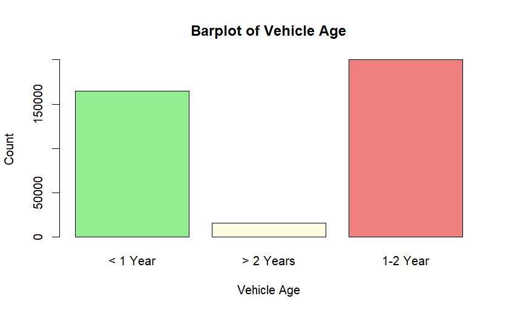
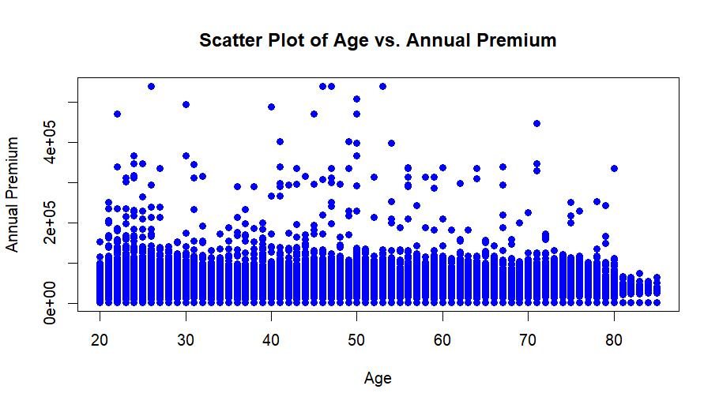

# Health Insurance Cross-Sell Analysis using Statistical Modeling

This project analyzes customer behavior in a large-scale insurance dataset using statistical methods and regression modeling to identify key factors influencing insurance purchase decisions.

---

## 🚀 Project Overview

Insurance companies aim to target customers who are most likely to purchase additional products.

This project explores customer-level data to:

- Understand purchase behavior  
- Identify key influencing factors  
- Extract actionable business insights  

The analysis focuses on interpretability through statistical modeling rather than black-box prediction.

---

## 📂 Dataset

The dataset contains:

- 381,000+ customer records  
- Demographics, vehicle information, and insurance history  
- Target variable: **Response (0 = No, 1 = Yes)**

👉 Dataset sample:  
[View full dataset](./data/Health_Insurance_Cross_Sell_Train_Dataset.csv)

### Example

| Age | Gender | Vehicle_Age | Premium | Response |
|-----|--------|------------|--------|----------|
| 44  | Male   | 1-2 Year   | 40454  | 1        |
| 23  | Female | < 1 Year   | 25000  | 0        |

---

## 🔬 Methodology

### Statistical Testing

The following hypothesis tests were applied:

- t-test  
- Chi-square test  
- ANOVA  
- Wilcoxon test  

These tests evaluate relationships between customer features and insurance purchase behavior.

---

### Regression Modeling

Logistic Regression (GLM) is used to model purchase probability:

Response ~ Age + Annual_Premium + Policy_Sales_Channel + Previously_Insured + Vintage

- Model selection via stepwise reduction  
- Interpretation of coefficients and significance levels  

---

## 📊 Results

### Distribution Analysis

- Premium distribution is highly right-skewed  
- Majority of customers fall into lower premium ranges  

---

### Customer Segmentation

- Most customers own relatively new vehicles  
- Vehicle age plays a key role in premium variation  

---

### Feature Relationships

- No strong linear relationship between age and premium  
- Indicates influence of additional hidden factors  

---

### Group Comparison

- Premium distribution is similar across genders  
- Presence of high-value outliers in both groups  

---

## 📉 Model Results

### Logistic Regression

    Coefficients:
                           Estimate Std. Error z value Pr(>|z|)     
    (Intercept)          -8.776e-01  2.797e-02 -31.377 < 2e-16 ***
    Age                  -1.412e-03  4.038e-04  -3.498 0.00047 ***
    Annual_Premium        2.440e-06  2.870e-07   8.503 < 2e-16 ***
    Policy_Sales_Channel -3.780e-03  1.056e-04 -35.800 < 2e-16 ***
    Previously_Insured   -5.698e+00  7.980e-02 -71.412 < 2e-16 ***
    Vintage              -8.886e-06  6.306e-05  -0.141 0.88794

#### Interpretation

- **Previously_Insured** is the strongest predictor (negative effect)  
- **Policy_Sales_Channel** significantly affects customer decisions  
- **Age** has a small but significant impact  
- **Annual_Premium** has a weak positive effect  
- **Vintage is not statistically significant**

---

### ANOVA Results

    Df    Sum Sq   Mean Sq F value Pr(>F)     
    Gender              1 1.523e+09 1.523e+09   5.162 0.0231 *   
    Vehicle_Age         2 4.462e+11 2.231e+11 756.059 < 2e-16 ***
    Vehicle_Damage      1 7.174e+09 7.174e+09  24.311 8.2e-07 ***
    Residuals      381104 1.125e+14 2.951e+08

#### Interpretation

- **Vehicle_Age** has the strongest effect on premium  
- **Vehicle_Damage** significantly impacts pricing  
- **Gender** has a smaller but significant effect  

---

## 🧠 Key Insights

- Previously insured customers are highly unlikely to convert  
- Vehicle-related features dominate pricing behavior  
- Premium distribution reveals strong segmentation  
- Demographic features alone are insufficient for prediction  

---

## 🛠️ Tech Stack

---

## 🔮 Future Work

- Apply machine learning models (XGBoost, Random Forest)  
- Improve predictive performance  
- Build customer scoring system  
- Deploy as decision-support tool  

---

## ⚡ Implementation

All analysis and modeling code is available in the `notebooks/insurance_analysis.R` directory.

---

## 👩‍💻 Author

**Irem Akcan**
