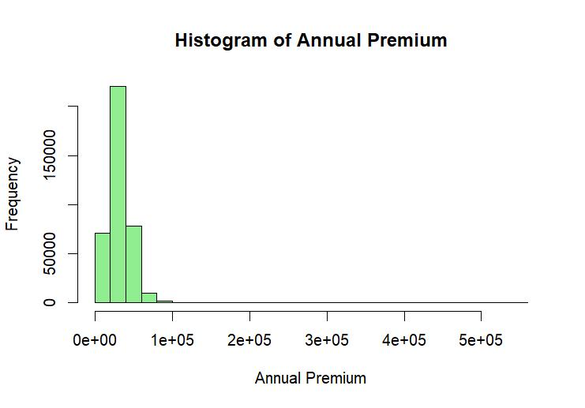
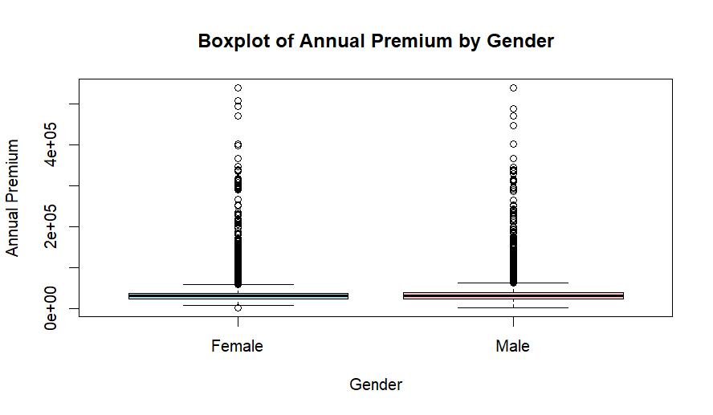

# Insurance Cross-Sell Prediction using Statistical Modeling

This project analyzes customer behavior in an insurance dataset to understand and predict which customers are likely to purchase vehicle insurance.

The analysis combines statistical hypothesis testing, regression modeling, and clustering techniques to extract actionable business insights.

---

## 🚀 Project Overview

Insurance companies aim to identify customers who are most likely to purchase additional products.

This project explores:

- What factors influence insurance purchase decisions?
- Which customers are most likely to convert?
- How can data-driven insights improve targeting strategies?

---

## 📂 Dataset

The dataset contains customer-level information including:

- Demographics (Age, Gender)
- Insurance history (Previously Insured)
- Vehicle information (Age, Damage)
- Financial features (Annual Premium)
- Target variable: `Response` (0 = No, 1 = Yes)

---

## 🔬 Methodology

The project applies a combination of statistical and machine learning techniques:

### Hypothesis Testing

- t-test
- F-test
- Chi-square test
- Wilcoxon test
- ANOVA + Tukey HSD

### Modeling

- Logistic Regression (GLM)
- Model Reduction (Stepwise AIC)
- Mixed Effects Model

### Unsupervised Learning

- PCA (Dimensionality Reduction)
- K-Means Clustering

---

## 📊 Key Results

### 📈 Customer Behavior Insights

- Customers who were previously insured are significantly **less likely** to purchase new insurance
- Annual premium is higher for customers who convert  
- Vehicle age strongly influences premium pricing  

---

## 📊 Data Visualization & Results

### Distribution of Annual Premium

<p align="center">

</p>

The premium distribution is right-skewed, indicating that most customers fall into lower premium ranges.

---

### Premium by Gender

<p align="center">

</p>

Premium values are broadly similar across genders, with minor variations.

---

### Correlation Analysis

<p align="center">

</p>

Previously_Insured is the most influential feature negatively associated with response.

---

### Statistical Analysis Results

<p align="center">

</p>

Statistical tests (t-test, chi-square, ANOVA) show strong significance across key variables.

---

### Model Insights

- Previously insured customers are significantly less likely to convert  
- Vehicle-related features strongly impact purchasing behavior  
- Premium levels correlate with customer segmentation

---

### 📉 Statistical Findings

- Strong statistical significance across multiple tests (p < 0.001)
- Gender has a measurable but smaller effect
- Premium distribution is right-skewed

---

## 📈 Model Example

Logistic regression formulation:

Response ~ Age + Annual_Premium + Policy_Sales_Channel + Previously_Insured

---

## 🛠️ Tech Stack

- R
- dplyr
- ggplot2
- readr
- lme4
- gamlss

---

## ⚡ Implementation

The full analysis and code are available in:

```

notebooks/insurance_analysis.R

```

---

## 🧠 Business Insight

- Target customers who are **not previously insured**
- Focus on specific vehicle age groups
- Optimize sales channels based on customer segments

---

## 🔮 Future Work

- Add machine learning models (XGBoost, Random Forest)
- Improve prediction performance
- Deploy as a scoring system

---

## 👩‍💻 Author

**Irem Akcan** 
